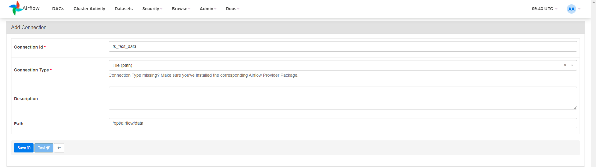

# How to run container
In order to start server simply run. First run will take few minutes image have to be built.
```
docker compose up
```

To run also elastic-search cluster run
```
docker compose --profile elastic up
```

To run also elastic-search cluster and kibana dashboard run
```
docker compose --profile elastic --profile debug up
```

To remove container run.
```
docker compose down
```

If you want to delete all volumes created run.
```
docker compose down --volumes --remove-orphans
```
If you want to delete all pulled images and volumes created run.
```
docker compose down --volumes --rmi all
```

If you want to rebuild base image (needed after adding package to requirements.txt):
``` 
docker compose build
```

# Services
## Airflow webserver: 
- port: http://localhost/8080
- username: airflow 
- password: airflow 

> **_NOTE:_**  After first webserver start you need to provide fs_conn_id in UI 

 \


## Kibana:
- port: http://localhost:5601/ 
- username: elastic 
- password: airflow 
## Elasticsearch:
- port: http://es01:9200/

# If smth won't work it is worth to try
```
sudo usermod -aG docker <your-user-name>
```
