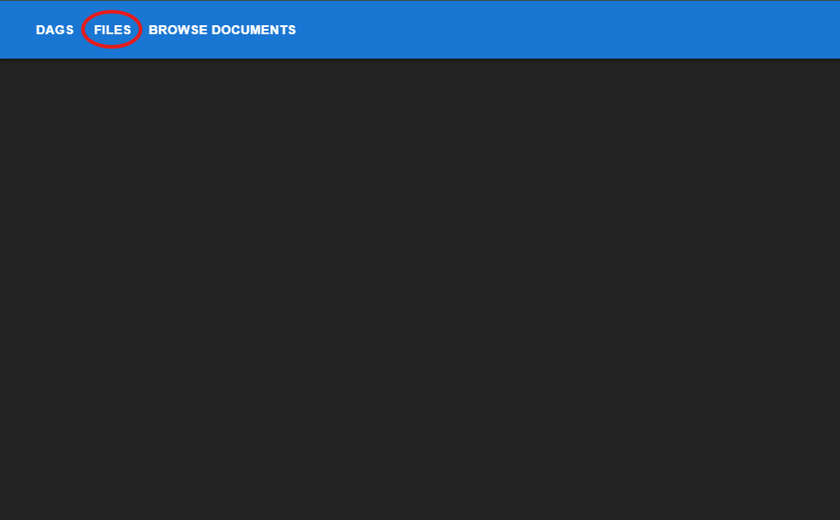
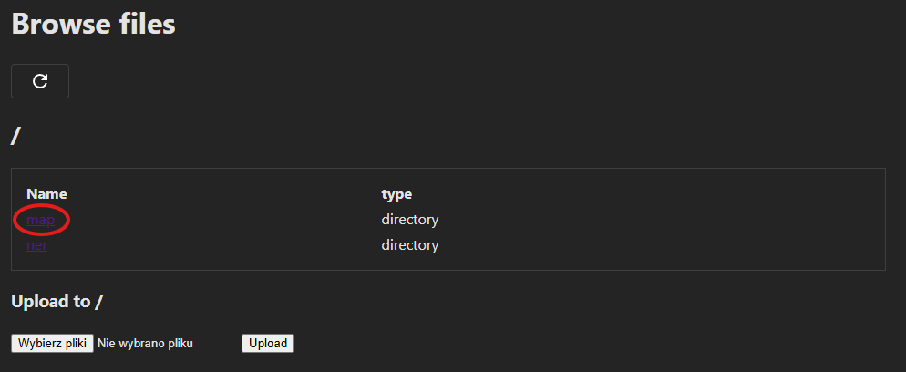
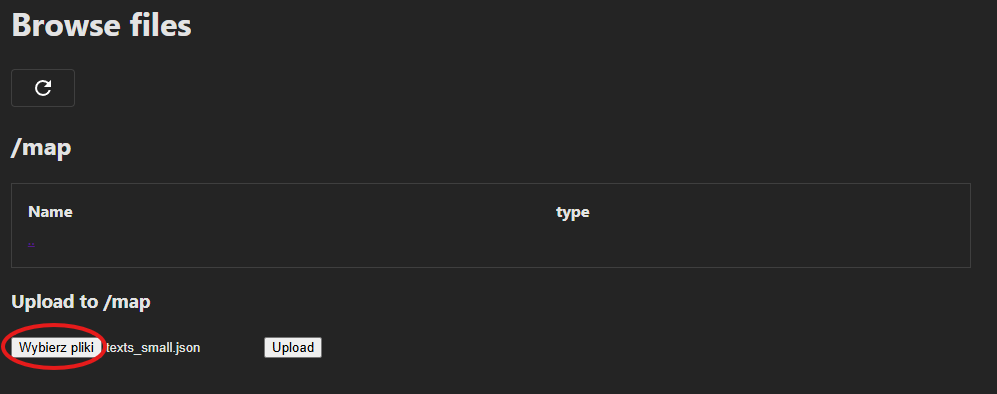
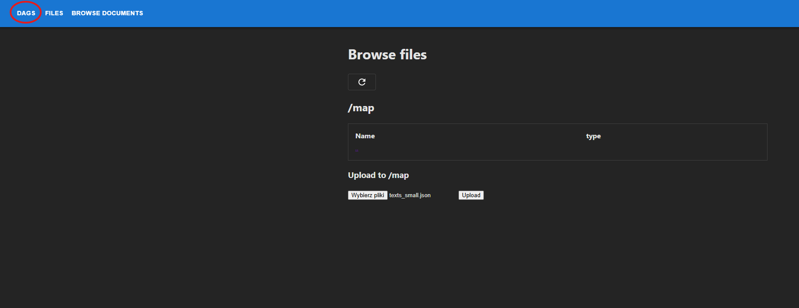
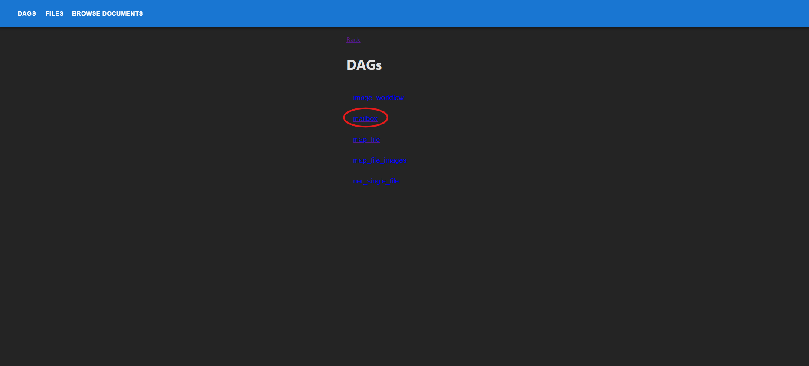
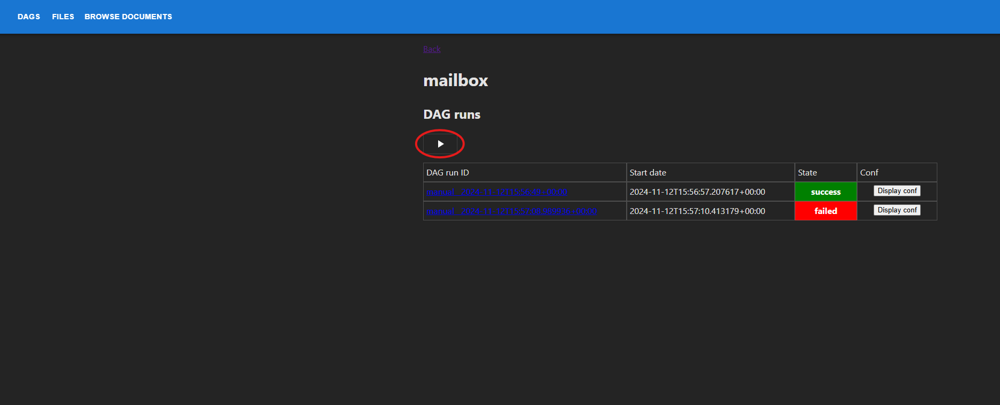
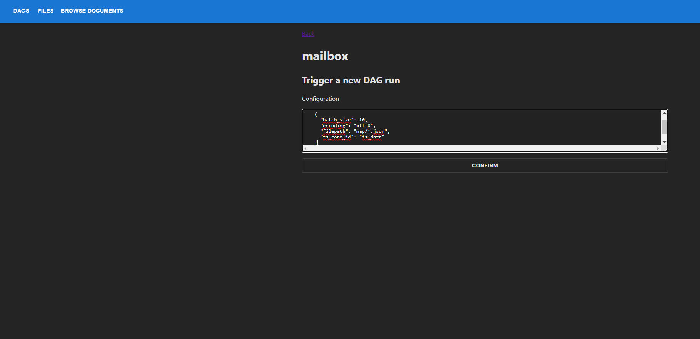

# DataRiver

## Quick start
### Requirements
In order to run the containers, you need [Docker](https://www.docker.com).


### Building Docker containers

Run Airflow, Elasticsearch and UI (**Recommended way**) 
```
docker compose --profile ui up
```

#### Alternatively

Run Airflow with Elasticsearch cluster and Kibana dashboard
```
docker compose --profile debug up
```

Rebuild base image (_required after modifying the requirements.txt file_)
```
docker compose build
```
## Running ner workflow from UI
### Step 1
Open http://localhost:3000/ in the browser.
### Step 2
Navigate to `FILES` in navbar \

### Step 3
Select map folder \

### Step 4
Browse and upload file ./test_data/texts/texts_small.json \

### Step 5
Navigate to `DAGS` in navbar \

### Step 6
Select mailbox dag \

### Step 7
Trigger dag \

### Step 8
Insert config below and run dag. 
```
{
  "batch_size": 10,
  "encoding": "utf-8",
  "filepath": "map/*.json",
  "fs_conn_id": "fs_data"
}
```

### Step 9
After a minute you can see processed data in `BROWSE DOCUMENTS`.

## Running image workflow from UI

### TO DO

## Service access
### Web UI
- default URL: http://localhost:3000/

### Airflow webserver:

- default URL: http://localhost:8080/
- username: _airflow_
- password: _airflow_


### Kibana:

- default URL: http://localhost:5601/
- username: elastic
- password: airflow

### Elasticsearch:

- default URL: http://es01:9200/

### Formatter 
You can format code with
```
docker compose up format
```

## Troubleshooting

If something doesn't work it is worth to try adding current system user to docker group
```
sudo usermod -aG docker <your-user-name>
```

## Cleaning up
Remove container
```
docker compose down
```

Delete all related volumes.
```
docker compose down --volumes --remove-orphans
```

Delete all related images and volumes
```
docker compose down --volumes --rmi all
```

## Docs

You can find the operators' description [here](docs.md)
