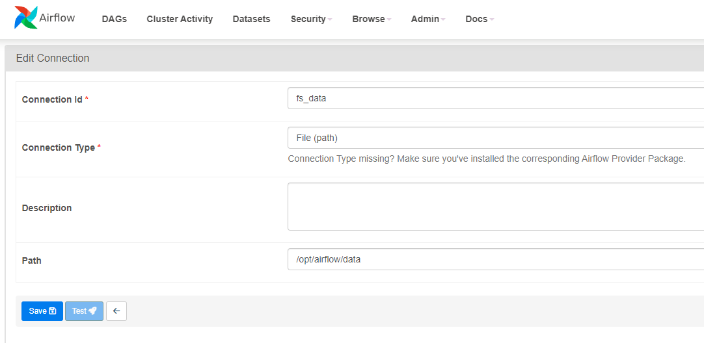
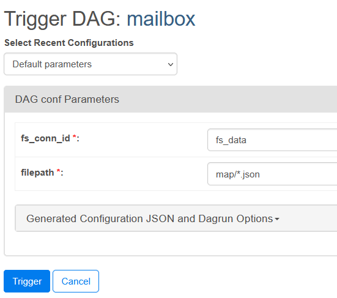

# DataRiver

## Quick start
### Requirements
In order to run the containers, you need [Docker](https://www.docker.com).


### Building Docker containers

Run Airflow, Elasticsearch and UI (**Recommended way**) 
```
docker compose --profile ui up
```

#### Alternatively

Run Airflow with Elasticsearch cluster and Kibana dashboard
```
docker compose --profile debug up
```

Rebuild base image (_required after modyfying the requirements.txt file_)
```
docker compose build
```
### Configuring the Apache Airflow
After the first launch, before triggering any DAGs, you need to provide required filesystem connections in Airflow.

### Step 1
Open http://localhost:8080/ in the browser.

### Step 2
Navigate to _Admin > Connections_: \


### Step 3
Select the _file (path)_ connection type, and provide the connection ID and the base directory path \


_Note: the `/opt/airflow/data` directory is preferred, it's directly mapped to `data` directory in the root of the project and allows easy way to upload files._

### Step 4
When triggering the `mailbox` DAG via UI, you need to provide two parameters: connection ID and path relative to the directory specified by connection with given ID. \


### Step 5
The `mailbox` DAG uses a sensor to wait for files.
In order to start processing the files, you need to put them in the directory specified in the DAG's configuration (default: `/opt/airflow/data/map/*.json`)

## Service access
### Web UI
- default URL: http://localhost:3000/

### Airflow webserver:

- default URL: http://localhost:8080/
- username: _airflow_
- password: _airflow_


### Kibana:

- default URL: http://localhost:5601/
- username: elastic
- password: airflow

### Elasticsearch:

- default URL: http://es01:9200/

### Formatter 
You can format code with
```
docker compose up format
```

## Troubleshooting

If something doesn't work it is worth to try adding current system user to docker group
```
sudo usermod -aG docker <your-user-name>
```

## Cleaning up
Remove container
```
docker compose down
```

Delete all related volumes.
```
docker compose down --volumes --remove-orphans
```

Delete all related images and volumes
```
docker compose down --volumes --rmi all
```

## Docs

You can find the operators' description [here](docs.md)
