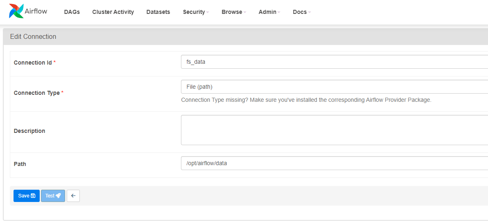

# DataRiver

## Quick start
### Requirements
_TODO: describe Docker and other system requirements_


### Building Docker containers

Run Airflow with Elasticsearch (**Recommended**) 
```
docker compose --profile elastic up
```

#### Alternatively
Launch only the Airflow containers \
(*note: provided DAGs won't work without providing other Elasticsearch server in configuration*)
```
docker compose up
```

Run with Elasticsearch cluster and Kibana dashboard
```
docker compose --profile elastic --profile debug up
```

Rebuild base image (_required after modyfying the requirements.txt file_)
```
docker compose build
```
### Configuring the Apache Airflow
After the first launch, before triggering any DAGs, you need to provide required filesystem connections in Airflow.
### Step 1:

Navigate to _Admin/Connections_:


### Step 2:

Select the _file (path)_ connection type, and provide the connection ID and the base directory path `/opt/airflow/data` \



## Service access

### Airflow webserver:

- default URL: http://localhost:8080/
- username: _airflow_
- password: _airflow_


### Kibana:

- default URL: http://localhost:5601/
- username: elastic
- password: airflow

### Elasticsearch:

- default URL: http://es01:9200/

## Troubleshooting

If something doesn't work it is worth to try adding current system user to docker group
```
sudo usermod -aG docker <your-user-name>
```

## Cleaning up
Remove container
```
docker compose down
```

Delete all related volumes.
```
docker compose down --volumes --remove-orphans
```

Delete all related images and volumes
```
docker compose down --volumes --rmi all
```

## Docs

You can find the operators' description [here](docs.md)